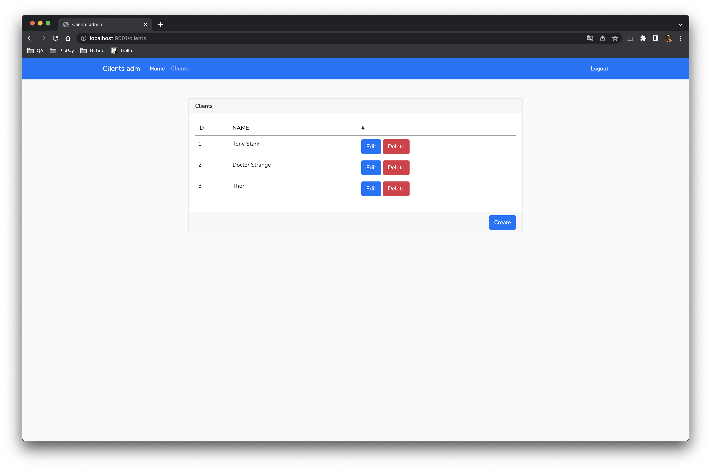

# Application Clients adm

Simple project created to show examples of how to use Vue.js and Bootstrap on the front-end and Laravel on the back-end.
- Vue 2
- Authenticate with JWT
- Clients CRUD
- Events using modal



## Project setup

### Config .env file
```
cp application/.env.example application/.env
```
- Create a secret 256-bit to JWT_TOKEN. (You can use [Generator](https://www.allkeysgenerator.com/Random/Security-Encryption-Key-Generator.aspx))


### Build
```
docker-compose up -d --build
```

### Install dependencies
```
docker exec app-clients-admin composer install
```
```
docker exec app-clients-admin php artisan key:generate
```
```
docker exec app-clients-admin npm install
```

### Build front-end
```
docker exec app-clients-admin npm run dev
```

### Create database sqlite
```
echo "" > application/database/database.sqlite
```


### Run migration and seeder
```
docker exec app-clients-admin php artisan migrate --seed
```

### Login
- Access: http://localhost:9001
- Email: michael@test.com
- Password: admin
